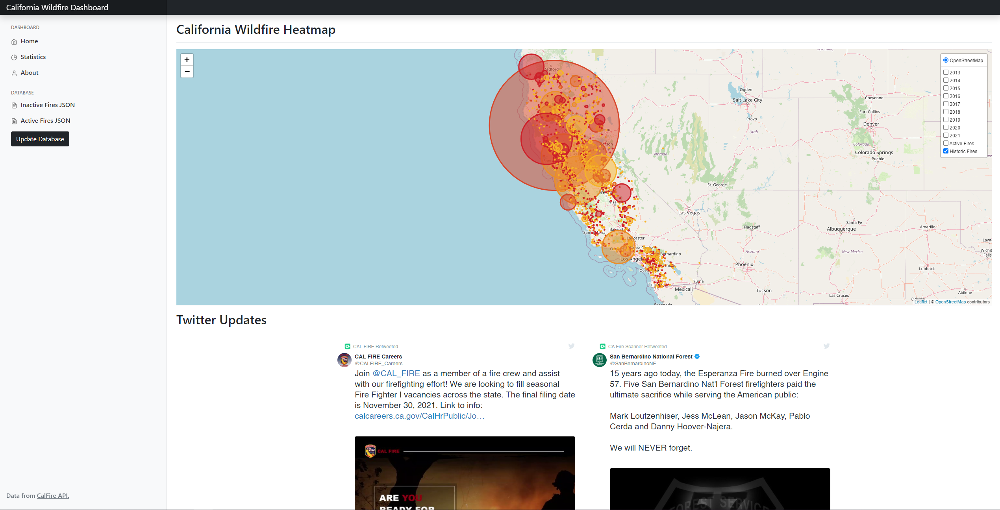
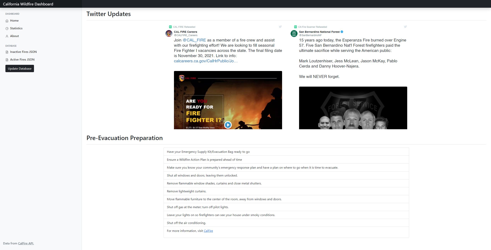
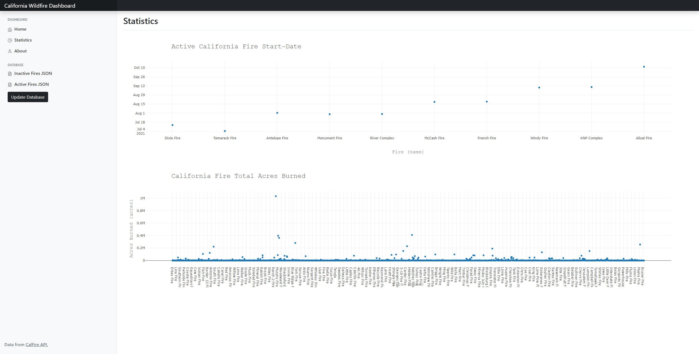
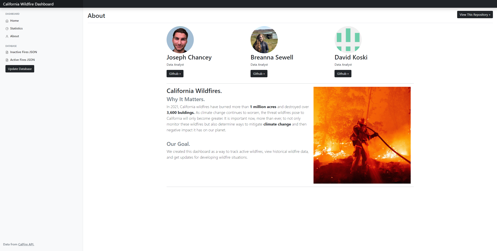
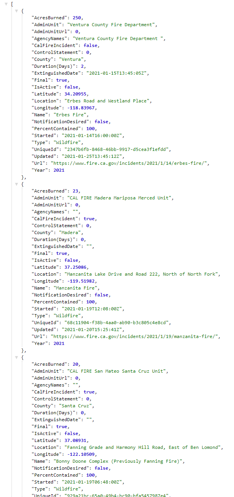

# California Wildfire Dashboard
Our California Wildfire Dashboard is a tool for individuals to view live wildfire activity as well as historic California wildfire data. This dashboard utilizes the E.T.L. process, of which data is collected from multiple sources, transformed, and put into a MongoDB database. Our goal for this dashboard is for individuals to view real-time wildfire data, get live updates, and stay informed. The statistics page on the dashboard provides analytical insights into hisotircal California wildfires.

## Repository Structure

* Flask app | [app.py](app.py)
* Scrape script | [scrape.py](scrape.py)
* HTML Webpage Flask Templates | [templates](tempaltes/)
* JavaScript & CSS Files | [static](static/)
* Jupyter Notebook Work | [starting-analysis.ipynb](jupyter/starting-analysis.ipynb)
* Project Images | [img](img/)

## Setting Up
To get this dashboard running on your machine you need to follow the steps below in order.
1. Clone the repository.
2. Path to the repository's folder on your system with your console.
3. Ensure you are inside the main folder, you should be inside the folder `ca-fire-dashboard`.
4. Type `flask run` in your console and press enter.
5. The dashboard will now be running locally on your machine, please use your Chromium based browser and go to the URL address `http://127.0.0.1:5000/`

If you have any questions, please feel free to reach out to any of the contributors. We will gladly help!

## Workflow

* Flask for backend 
* MongoDB for database + PyMongo
* Bootstrap 5 for Styling
* JavaScript for visualizations (chart.js + leaflet.js + plotly.js + D3.js)
* Python 3 for Web Scraping/Data Collection (scrape.py)

## Team Roles

**Joseph Chancey:** Git/Github management, Flask backend, MongoDB Setup, Front-end design, Data Loading.

**Breanna Sewell:** Data Wrangling for Leaflet.js, Data Visualiation, Data Transformation, Data Loading, Flask routing.

**David Koski:** Statistical Analysis, Data Visualization, Data Wrangling (plotly.js + chart.js), Web Scraping, Data Loading, Flask routing.

## Home

The homepage of the dashboard gives users the ability to view active fires as well as historic fires from 2013-2021.

## Twitter Updates & Evacuation Readiness (CalFire)

At the bottom of the home page users are able to view Twitter updates from CalFire and CaFireUpdates, this provides emergency alerts. Below that is a link to the CalFire pre-evacuation check-list, along with some key points for pre-evacuation.

## Statistics

The statistics page provides more insights on California Wildfires. Currently W.I.P. - Not fully merged with main. Please view branch `david-k` for an updated Statistics page. (Last updated Nov 1, 2021).

## About

The about page references the creators and provides a mission statement.

## Database 

Users can use the URL address bar to ping the database in real time. Flask routes allow for D3.js to grab the json data from MongoDB. 

## Conclusion
Our Dashboard allows users to view realtime California wildfire data and provides analytical insights on historic California Wildfires. Our mission was to provide a tool for users to view California Wildfire data in an easily accessible and meaningful way. We believe to have accomplished this goal.

### Thank you!
